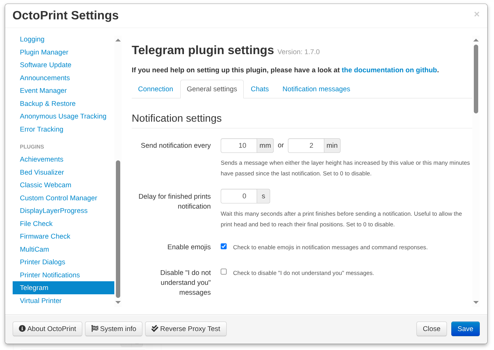
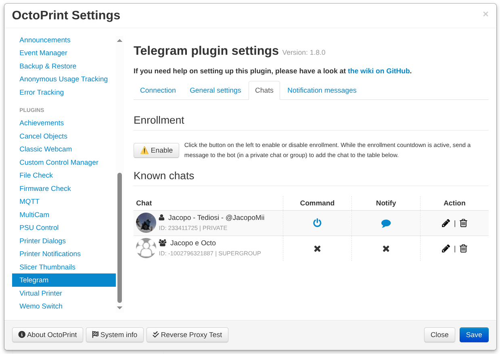

# OctoPrint-Telegram


This plugin integrates Telegram Messenger with OctoPrint through a bot that can be used in both private chats and groups.

It allows you to remotely control your printer — including browsing and uploading files, starting, pausing, or cancelling prints — as well as viewing snapshots and short videos from your webcams. Send the `/help` command to get a full list of supported commands.

The plugin can also send notifications when specific events occur (e.g., when a print finishes) or at configurable intervals during a print.

## [Go to releases](https://github.com/jacopotediosi/OctoPrint-Telegram/releases)

## Screenshots

(Click on any image to enlarge)

| | | | |
|--------------|--------------|--------------|--------------|
|  |  |  |  |
|  |  |  |  |

## Installation and usage

Search for the **Telegram Notifications** plugin using the bundled [Plugin Manager](https://github.com/foosel/OctoPrint/wiki/Plugin:-Plugin-Manager), or install it manually using the following URL:
```
https://github.com/jacopotediosi/OctoPrint-Telegram/archive/master.zip
```

For full installation and usage instructions, available features, configuration guidance, and common troubleshooting steps, please refer to the **[plugin’s Wiki](https://github.com/jacopotediosi/OctoPrint-Telegram/wiki)**.

## Support the project

This project is distributed for free and maintained entirely by volunteers, who do their best to develop it in their spare time, gather feedback and reports from users, and fix issues.

If you'd like to support the maintainers of this project, you can donate via the **[GitHub Sponsor page](https://github.com/sponsors/jacopotediosi)** :heart:.

## Contacts

You can get support and connect with the maintainers and other users of this plugin by joining the **[Octoprint-Telegram-Users Group](https://telegram.me/joinchat/CXFirQjl9XTp5dr4OZqH9Q)**.
